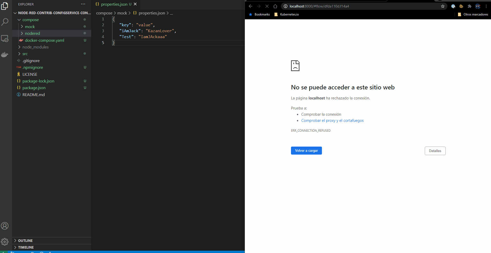

# node-red-context-configservice
[Spring Cloud Config](https://cloud.spring.io/spring-cloud-config/reference/html/#_spring_cloud_config_server) provides server-side for externalized configuration in a distributed system. You have a central place to manage external properties for applications across all environments.

Node-RED provides a way to store information that can be shared between different nodes without using the messages that pass through a flow. This is called [context](https://nodered.org/docs/user-guide/context).

The scope of a particular context value determines who it is shared with. There are three context scope levels:
* Node - only visible to the node that set the value
* Flow - visible to all nodes on the same flow (or tab in the editor)
* Global - visible to all nodes

We are looking for use both features, to retrieve and storage  externalized configuration in our Node-RED Global context.

## Context Store with ConfigService
Node-RED provides two built-in modules for this:
* memory
* localfilesystem

We build a custom one based on the **memory** one.

To enable it, the following option in your Node-RED **settings.js** file can be used:
```
contextStorage: {
    default: {
        module: config => (require("@doing-things-with-node-red/node-red-context-configservice")(
            "http://configservice:80/properties.json",
            {
                strictSSL: true,
                interval: 3600000,
                retries: 3
            }
        ))
    }
},
```

## Compose
We are using Docker Compose to test our e2e
